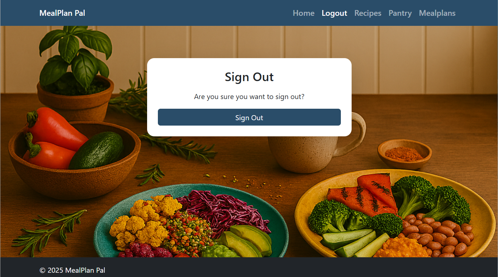

# MealPlan Pal

## Overview

MealPlan Pal is a full-featured Django web application designed to simplify meal planning, pantry management, and shopping list generation for individuals and families. The platform empowers users to organize their weekly meals, keep track of pantry inventory, and automatically generate shopping lists based on planned recipes and available ingredients.

**Key highlights include:**
- **Intuitive Dashboards:** Grouped navigation for Recipes, Pantry, Meal Plans, and Shopping, all styled with a modern Bootstrap 5 UI.
- **Recipe Management:** Create, edit, and delete your own recipes, or search for new ideas using an integrated external recipe API.
- **Smart Pantry Tracking:** Add, update, and remove pantry items, with suggestions for recipes you can make from what you have.
- **Meal Planning:** Build weekly meal plans by assigning recipes to days and meal types, with a visual calendar interface.
- **Automated Shopping Lists:** Instantly generate a shopping list for your meal plan, factoring in what’s already in your pantry to avoid duplicate purchases.
- **User Permissions:** Secure, user-specific data—each user’s pantry, recipes, and plans are private and protected.
- **Robust Testing:** Comprehensive backend test suite ensures reliability, security, and correctness of all major features.

MealPlan Pal is ideal for anyone looking to save time, reduce food waste, and streamline their meal preparation process—all in a user-friendly, mobile-responsive web app.

## Table of Contents
1. Overview
2. Features
3. User Stories & Acceptance Criteria
4. App Structure
5. Database Models
6. Wireframes
7. Color Palette
8. Diagrams
9. Setup & Installation
10. Configuration
11. Testing & Validation
12. Usage Guide
13. Screenshots
14. Known Issues & Limitations
15. Contributing
16. Acknowledgments


## Features

MealPlan Pal offers a comprehensive set of features to make meal planning and grocery management easy and efficient:

### 🔧 Feature Overview

| Area      | Features                                                                 |
|-----------|--------------------------------------------------------------------------|
| **Recipes**   | - Create, view, edit, and delete personal recipes<br>- Dashboard for managing all recipes<br>- Search and import recipes from an external API<br>- Get recipe suggestions based on pantry contents |
| **Pantry**    | - Add, update, and remove pantry items<br>- Dashboard for quick inventory overview<br>- See which recipes you can make with current ingredients<br>- Add missing ingredients to shopping list |
| **Meal Plans**| - Create, edit, and delete weekly meal plans<br>- Assign recipes to specific days and meal types<br>- Visual calendar interface for planning<br>- Dashboard for managing all meal plans |
| **Shopping**  | - Automatically generate shopping lists from meal plans<br>- Shopping list only includes items not already in pantry<br>- Check off items as you shop<br>- Dashboard for managing shopping lists |
| **User Management & Security** | - User authentication and registration<br>- Each user’s data is private and secure<br>- Permissions enforced for all CRUD operations |
| **UI/UX**     | - Modern, responsive Bootstrap 5 design<br>- Grouped navigation and active tab highlighting<br>- Clean, intuitive dashboards for each feature area |

### 🧩 Data Model Overview

The following models form the core of MealPlan Pal’s backend, supporting all major features:

| Model                | Fields & Relationships                                                                                 | Description                                                                 |
|----------------------|--------------------------------------------------------------------------------------------------------|-----------------------------------------------------------------------------|
| **User**             | username, email, password, ...                                                                         | Built-in Django user model for authentication and ownership                  |
| **Recipe**           | title, description, image, calories, owner (FK to User), is_public                                     | Stores user-created or imported recipes                                      |
| **Ingredient**       | name, unit                                                                                             | Represents a single ingredient (e.g., Carrot, pcs)                           |
| **RecipeIngredient** | recipe (FK), ingredient (FK), amount                                                                   | Links a recipe to its ingredients and quantities                             |
| **PantryItem**       | user (FK), ingredient (FK), amount                                                                     | Tracks what each user has in their pantry                                    |
| **MealPlan**         | owner (FK to User), week_start_date                                                                    | Represents a user’s meal plan for a given week                               |
| **MealPlanItem**     | mealplan (FK), recipe (FK), day_of_week, meal_type                                                     | Assigns recipes to specific days/meals in a meal plan                        |
| **ShoppingItem**     | mealplan (FK), ingredient (FK), total_amount, checked                                                  | Items to buy for a meal plan, factoring in pantry inventory                  |

**Relationships:**
- A `User` owns many `Recipes`, `PantryItems`, and `MealPlans`.
- A `Recipe` has many `RecipeIngredients` (each linking to an `Ingredient`).
- A `MealPlan` has many `MealPlanItems` (each linking to a `Recipe`).
- A `ShoppingItem` is generated for each ingredient needed for a meal plan.

**ER Diagram (Textual):**
```
User <-- PantryItem --> Ingredient
User <-- Recipe
Recipe <-- RecipeIngredient --> Ingredient
MealPlan <-- MealPlanItem --> Recipe
MealPlan <-- ShoppingItem --> Ingredient
```

---

## User Stories & Acceptance Criteria

Below are the user stories for MealPlan Pal. the detailed user stories and acceptance criteria can be found on here 

**Legend:**
- MH = Must Have
- SH = Should Have
- CH = Could Have
- WH = Won't Have.

Note: There was no WH on this project


- As a user, I want a modern, responsive interface that works well on desktop and mobile. mh
- As a user, I want to create and manage my own recipes so that I can easily reuse them in meal plans. mh
- As a user, I can drag recipes into a weekly meal calendar so that I can plan my meals. mh
- As a user, I can generate a shopping list so I know what to buy. mh
- As a user, I can enter the ingredients I have so that the system suggests recipes I can cook. sh
- As a user, I want to search for and import recipes from an external API so I can save them to my recipes and create a meal plan thereafter. mh
- As a user, I want to mark a recipe as public so that others can use it, while guaranteeing that my personal data (recipes, pantry, meal plans) remains private and secure. sh
- As a user, I can share my meal plan or create a household group so we can plan meals together. CH
- As a user, I can view weekly nutrition stats so that I understand my dietary intake. SH
- As a user, I want to print or export my shopping list. Ch
- As a user, I want to receive notifications for expiring pantry items so that I can update my pantry list . sh

## App Structure

MealPlan Pal follows a standard Django project structure with the following key components:

```
mealplan_pal/
│
├── pantry_pal/                # Main app directory
│   ├── migrations/             # Database migrations
│   ├── __init__.py
│   ├── admin.py                # Admin panel configuration
│   ├── apps.py                 # App configuration
│   ├── models.py               # Database models
│   ├── tests.py                # Backend tests
│   ├── urls.py                 # URL routing
│   └── views.py                # Business logic and request handling
│
├── templates/                 # HTML templates
│   ├── base.html               # Base template
│   ├── recipes/               # Recipe-related templates
│   ├── pantry/                # Pantry-related templates
│   ├── mealplans/             # Meal plan-related templates
│   └── shopping/              # Shopping list-related templates
│
├── static/                    # Static files (CSS, JavaScript, images)
│
├── media/                     # User-uploaded files (e.g., recipe images)
│
├── db.sqlite3                 # SQLite database file (for development)
│
├── manage.py                  # Django management script
│
└── requirements.txt           # Python package dependencies
```

---

## Database Models

The following models form the core of MealPlan Pal’s backend, supporting all major features:

| Model                | Fields & Relationships                                                                                 | Description                                                                 |
|----------------------|--------------------------------------------------------------------------------------------------------|-----------------------------------------------------------------------------|
| **User**             | username, email, password, ...                                                                         | Built-in Django user model for authentication and ownership                  |
| **Recipe**           | title, description, image, calories, owner (FK to User), is_public                                     | Stores user-created or imported recipes                                      |
| **Ingredient**       | name, unit                                                                                             | Represents a single ingredient (e.g., Carrot, pcs)                           |
| **RecipeIngredient** | recipe (FK), ingredient (FK), amount                                                                   | Links a recipe to its ingredients and quantities                             |
| **PantryItem**       | user (FK), ingredient (FK), amount                                                                     | Tracks what each user has in their pantry                                    |
| **MealPlan**         | owner (FK to User), week_start_date                                                                    | Represents a user’s meal plan for a given week                               |
| **MealPlanItem**     | mealplan (FK), recipe (FK), day_of_week, meal_type                                                     | Assigns recipes to specific days/meals in a meal plan                        |
| **ShoppingItem**     | mealplan (FK), ingredient (FK), total_amount, checked                                                  | Items to buy for a meal plan, factoring in pantry inventory                  |

**Relationships:**
- A `User` owns many `Recipes`, `PantryItems`, and `MealPlans`.
- A `Recipe` has many `RecipeIngredients` (each linking to an `Ingredient`).
- A `MealPlan` has many `MealPlanItems` (each linking to a `Recipe`).
- A `ShoppingItem` is generated for each ingredient needed for a meal plan.

---

## Wireframes

Below are wireframes styled to look like screenshots, illustrating the main user flows, dashboards, and forms.

### Home Page

```text
+-------------------------------------------------------------+
| MealPlan Pal         [Login] [Register]                     |
+-------------------------------------------------------------+
| [Recipes] [My Pantry] [Meal Plans] [Shopping List] [Logout] |
+-------------------------------------------------------------+
| Welcome to MealPlan Pal!                                    |
|                                                             |
| [ Get Started ]                                             |
+-------------------------------------------------------------+
```

### Recipes Dashboard

```text
+-------------------------------------------------------------+
| Recipes Dashboard                                           |
+-------------------------------------------------------------+
| [My Recipes] [Create Recipe] [Search Recipes] [Suggestions] |
+-------------------------------------------------------------+
| +-------------------------------+                           |
| | Title        | Actions        |                           |
| |--------------|---------------|                           |
| | Carrot Soup  | [Edit] [Del]  |                           |
| | Pasta Salad  | [Edit] [Del]  |                           |
| +-------------------------------+                           |
|                                                             |
| [Add New Recipe]                                            |
+-------------------------------------------------------------+
```

### Recipe Form

```text
+-------------------------------------------------------------+
| Create/Edit Recipe                                          |
+-------------------------------------------------------------+
| Title:         [__________________________]                 |
| Description:   [__________________________]                 |
| Calories:      [____]      Image: [Choose File]             |
| Ingredients:                                            [+] |
|   [Ingredient] [Amount] [Unit] [Remove]                     |
|   [Carrot   ] [   2  ] [pcs]   [ X ]                        |
|   [Potato   ] [   1  ] [kg ]   [ X ]                        |
|                                                             |
| [ Save ]   [ Cancel ]                                       |
+-------------------------------------------------------------+
```

### Pantry Dashboard

```text
+-------------------------------------------------------------+
| Pantry Dashboard                                            |
+-------------------------------------------------------------+
| [My Pantry] [Suggest Recipes]                               |
+-------------------------------------------------------------+
| +-------------------------------+                           |
| | Ingredient | Amount | Unit | Actions |                    |
| |------------|--------|------|---------|                    |
| | Carrot     |   2    | pcs  | [Edit]  |                    |
| | Potato     |   1    | kg   | [Edit]  |                    |
| +-------------------------------+                           |
|                                                             |
| [Add Pantry Item]                                           |
+-------------------------------------------------------------+
```

### Pantry Item Form

```text
+-------------------------------------------------------------+
| Add/Edit Pantry Item                                        |
+-------------------------------------------------------------+
| Ingredient:   [______________]                              |
| Amount:       [____]                                        |
| Unit:         [____]                                        |
|                                                             |
| [ Save ]   [ Cancel ]                                       |
+-------------------------------------------------------------+
```

### Meal Plan Dashboard

```text
+-------------------------------------------------------------+
| Meal Plan Dashboard                                         |
+-------------------------------------------------------------+
| [Create Meal Plan] [Calendar View]                          |
+-------------------------------------------------------------+
| +-------------------+-------------------+-----------------+ |
| | Monday            | Tuesday           | ...             | |
| +-------------------+-------------------+-----------------+ |
| | Lunch: Carrot Soup| Dinner: Pasta     | ...             | |
| | ...               | ...               | ...             | |
| +-------------------+-------------------+-----------------+ |
|                                                             |
| [Edit Plan] [Delete Plan]                                   |
+-------------------------------------------------------------+
```

### Shopping List

```text
+-------------------------------------------------------------+
| Shopping List                                              |
+-------------------------------------------------------------+
| [Select Meal Plan ▼]                                       |
+-------------------------------------------------------------+
| +-------------------+----------+--------+---------+         |
| | Ingredient        | Amount   | Unit   | Bought  |         |
| |-------------------|----------|--------|---------|         |
| | Carrot            |   2      | pcs    | [  ]    |         |
| | Potato            |   1      | kg     | [✔]     |         |
| +-------------------+----------+--------+---------+         |
|                                                             |
| [Print List]                                               |
+-------------------------------------------------------------+

```
### Screenshots


*Welcome page with navigation options.*


*Form for creating or editing a recipe.*


*View and manage your pantry items.*


*Create and manage your meal plans on a weekly calendar.*


*Your shopping list, generated from the meal plan.*


*sign out form.*

---

## Color Palette

The MealPlan Pal UI uses a modern, accessible color palette for clarity and usability. All colors are chosen for strong contrast and a clean, professional look.

| Color Name    | Hex      | Usage                                 | Preview        |
|-------------- |----------|---------------------------------------|----------------|
| Primary Blue  | #0d6efd  | Navbar, buttons, links                | <span style="display:inline-block;width:24px;height:16px;background:#0d6efd;border:1px solid #ccc;"></span> |
| Success Green | #198754  | Add/Create buttons, success messages  | <span style="display:inline-block;width:24px;height:16px;background:#198754;border:1px solid #ccc;"></span> |
| Warning Gold  | #ffc107  | Warnings, suggestions, highlights     | <span style="display:inline-block;width:24px;height:16px;background:#ffc107;border:1px solid #ccc;"></span> |
| Danger Red    | #dc3545  | Delete buttons, error messages        | <span style="display:inline-block;width:24px;height:16px;background:#dc3545;border:1px solid #ccc;"></span> |
| Info Cyan     | #0dcaf0  | Info alerts, secondary highlights     | <span style="display:inline-block;width:24px;height:16px;background:#0dcaf0;border:1px solid #ccc;"></span> |
| Dark Gray     | #212529  | Footer, text, active tab              | <span style="display:inline-block;width:24px;height:16px;background:#212529;border:1px solid #ccc;"></span> |
| Light Gray    | #f8f9fa  | Backgrounds, cards, input fields      | <span style="display:inline-block;width:24px;height:16px;background:#f8f9fa;border:1px solid #ccc;"></span> |
| White         | #ffffff  | Main backgrounds, cards, forms        | <span style="display:inline-block;width:24px;height:16px;background:#ffffff;border:1px solid #ccc;"></span> |
| Black         | #000000  | Text, icons                           | <span style="display:inline-block;width:24px;height:16px;background:#000000;border:1px solid #ccc;"></span> |

---

## Diagrams

### Entity-Relationship Diagram (ERD)

```text
[User] 1---* [Recipe]
[User] 1---* [PantryItem] *---1 [Ingredient]
[User] 1---* [MealPlan] 1---* [MealPlanItem] *---1 [Recipe]
[Recipe] 1---* [RecipeIngredient] *---1 [Ingredient]
[MealPlan] 1---* [ShoppingItem] *---1 [Ingredient]
```

**Legend:**
- `1---*` means one-to-many
- `*---1` means many-to-one

**Description:**
- A User can have many Recipes, PantryItems, and MealPlans.
- Each Recipe can have many RecipeIngredients, each linking to an Ingredient.
- Each MealPlan can have many MealPlanItems (each for a day/meal), each linking to a Recipe.
- ShoppingItems are generated for each Ingredient needed for a MealPlan, factoring in PantryItems.

---

### Application Flow Diagram

```text
[User Login/Register]
        |
        v
[Dashboard/Main Navigation]
        |
        +-------------------+-------------------+-------------------+
        |                   |                   |                   |
   [Recipes]           [Pantry]           [Meal Plans]        [Shopping List]
        |                   |                   |                   |
   CRUD, Search,      CRUD, Suggest      Create/Edit,         View, Check,
   Import, Suggest    Recipes            Assign Recipes        Print
        |                   |                   |                   |
        +-------------------+-------------------+-------------------+
        |
        v
   [User Logout]
```

**Description:**
- Users log in and access the main dashboard.
- Navigation tabs allow switching between Recipes, Pantry, Meal Plans, and Shopping List.
- Each section supports CRUD and specialized actions (e.g., recipe import, meal plan assignment, shopping list generation).
- Users can log out from any page.

---

## Setup & Installation

Follow these steps to get MealPlan Pal running locally:

1. **Clone the repository:**
   ```bash
   git clone https://github.com/Tima-S9/mealplan-pal.git
   cd mealplan-pal
   ```
2. **Create a virtual environment (recommended):**
   ```bash
   python -m venv venv
   source venv/bin/activate  # On Windows: venv\Scripts\activate
   ```
3. **Install dependencies:**
   ```bash
   pip install -r requirements.txt
   ```
4. **Apply database migrations:**
   ```bash
   python manage.py migrate
   ```
5. **Create a superuser (admin account):**
   ```bash
   python manage.py createsuperuser
   ```
6. **Start the development server:**
   ```bash
   python manage.py runserver
   ```
7. **Access the app:**
   Open your browser and go to [http://127.0.0.1:8000/](http://127.0.0.1:8000/)

---

## Configuration

- **Environment Variables:**
  - By default, settings are configured for local development.
  - To use a custom database, update `DATABASES` in `pantry_pal/settings.py`.
  - For production, set `DEBUG = False` and configure `ALLOWED_HOSTS`.
- **Static Files:**
  - Collect static files for production with:
    ```bash
    python manage.py collectstatic
    ```
- **External APIs:**
  - If using an external recipe API, add your API key in `pantry_pal/settings.py` or as an environment variable.
- **Email (optional):**
  - Configure email backend in `settings.py` for password reset features.

---

## Testing & Validation

MealPlan Pal includes a comprehensive backend test suite to ensure the reliability, security, and correctness of all major features. The tests are written using Django’s built-in TestCase framework and cover CRUD operations, permissions, edge cases, and integration flows for all core app modules.
### How to run the tests:
1. **Install dependencies**
   Make sure you have all requirements installed:
   ```bash
   pip install -r requirements.txt
   ```
2. **Run the test suite**
   From the project root, run:
   ```bash
   python manage.py test
   ```
   This will automatically create a test database, run all tests, and display a summary of results.

### Test Coverage

The following features and scenarios are covered by the test suite:

#### Pantry Management
- **Create Pantry Item:** Verifies that a user can add a new pantry item with the correct ingredient and amount.
- **Edit Pantry Item:** Ensures a user can update the amount of an existing pantry item.
- **Delete Pantry Item:** Confirms a user can remove a pantry item from their list.

#### Recipe Management
- **Create Recipe:** Tests that a user can create a new recipe, including all required fields and form validation.
- **Edit Recipe:** Checks that a user can update recipe details.
- **Delete Recipe:** Ensures a user can delete a recipe they own.

#### Meal Plan Management
- **Create Meal Plan:** Validates that a user can create a meal plan for a specific week.

#### Shopping List Generation
- **Generate Shopping List:** Simulates the process of adding a recipe’s ingredients to a shopping list for a selected meal plan, ensuring all related models (MealPlan, Recipe, RecipeIngredient, PantryItem, ShoppingItem) interact correctly.

#### Permissions and Security
- **Edit Other User’s Pantry Item (Forbidden):** Ensures users cannot edit pantry items belonging to other users.
- **Delete Other User’s Pantry Item (Forbidden):** Ensures users cannot delete pantry items belonging to other users.

### Test Results

All tests are currently passing:

| Test Class             | Test Method                              | Status |
|----------------------- |------------------------------------------|--------|
| PantryItemModelTest    | test_create_pantry_item                  | Passed |
| PantryItemModelTest    | test_edit_pantry_item                    | Passed |
| PantryItemModelTest    | test_delete_pantry_item                  | Passed |
| RecipeTest             | test_create_recipe                       | Passed |
| RecipeTest             | test_edit_recipe                         | Passed |
| RecipeTest             | test_delete_recipe                       | Passed |
| MealPlanTest           | test_create_mealplan                     | Passed |
| ShoppingListTest       | test_generate_shopping_list              | Passed |
| PermissionsTest        | test_edit_other_user_item_forbidden      | Passed |
| PermissionsTest        | test_delete_other_user_item_forbidden    | Passed |
| **Total: 10 tests, all passed.**                                 |

### Validation Approach

- **Isolated Test Database:** Tests run in a temporary database, ensuring no impact on production or development data.
- **Edge Case Handling:** Tests include edge cases such as permission violations and empty form submissions.
- **Debugging Support:** Tests were iteratively improved with debug output to ensure accurate diagnosis and validation of all backend logic.

### How to Add More Tests

To extend test coverage, add new test methods to `tests.py` following the structure of existing tests. Each test should:
- Set up the required data and user context.
- Perform the action (e.g., POST, GET).
- Assert the expected outcome using `self.assertEqual`, `self.assertTrue`, or `self.assertFalse`.

### Test Files Overview

- `tests.py` (Django): Unit/integration tests for models and views (located in your project root).
- `test_user_flows.spec.js`: Playwright end-to-end browser tests for key user flows.
- `TESTING_README.md`: A comprehensive list of all test files, their locations, and how they work.


*Tests.py success screnshot*

### html validation
 - all html files validated


*Html validation screenshot*

### CSS Validation
Both CSS files were validated


*Css Validation screenshot.*

---

## Usage Guide

MealPlan Pal is designed to be intuitive and user-friendly. Here’s a quick guide on how to use the main features:

1. **Recipes:**
   - To create a recipe, go to the Recipes dashboard and click on "Create Recipe".
   - Fill in the recipe details, including ingredients and instructions.
   - Save the recipe, and it will be added to your personal recipe collection.

2. **Pantry:**
   - Access the Pantry dashboard to view your current ingredients.
   - Click "Add Pantry Item" to include new ingredients, or edit existing ones to update their quantity or details.
   - Use the "Suggest Recipes" feature to find recipes you can make with your available ingredients.

3. **Meal Plans:**
   - Navigate to the Meal Plan section and click "Create Meal Plan".
   - Select the week for your meal plan and assign recipes to each day and meal type.
   - Save your meal plan, and it will be available in the Meal Plan dashboard.

4. **Shopping List:**
   - Go to the Shopping List section to view your automated shopping list.
   - The list is generated based on your meal plan and pantry inventory.
   - Check off items as you shop, and print the list if needed.

5. **User Management:**
   - Sign up or log in to access your personal dashboards.
   - Your recipes, pantry items, and meal plans are private and secure.

For a more detailed guide, refer to the in-app help section or the user manual provided in the documentation.

---

## Known Issues & Limitations

- **Performance:** The app is optimized for small to medium-sized databases. Performance may vary with very large datasets.
- **API Limitations:** External recipe suggestions depend on the availability and rate limits of the integrated recipe API.
- **Email Functionality:** Email features require proper email backend configuration in `settings.py`.

---

## Contributing

Contributions are welcome! To contribute to MealPlan Pal:

1. Fork the repository.
2. Create a new branch for your feature or bug fix.
3. Make your changes and commit them with clear messages.
4. Push your branch and submit a pull request.

Please ensure your code follows the existing style and includes appropriate tests.

---


## Acknowledgments

MealPlan Pal is built with the help of many open-source projects and libraries. Special thanks to:

- **Django:** The web framework powering MealPlan Pal.
- **Bootstrap 5:** For the responsive and modern UI components.
- **External Recipe API:** For providing recipe data and suggestions.
- **GitHub Copilot:** For AI-powered coding assistance and documentation support.
- **Copilot** for bg- image generation.
- **Code institute Resources**

---

## Agile & Project Management

This project follows Agile methodologies and uses a public GitHub Project Board to track progress, prioritize tasks, and map user stories to development work.

- **Project Board:** [MealPlan Pal Project Board](https://github.com/Tima-S9/mealplan-pal/projects)
- The board includes at least four columns: Backlog, Todo, In Progress, and Done.
- User stories are mapped to tasks and issues for clear traceability.
- MoSCoW prioritization is used to evidence feature importance and delivery order.

## Deployment

To deploy MealPlan Pal to a production environment:

1. **Set environment variables:**
   - Ensure `DEBUG = False` in `pantry_pal/settings.py` or via environment variable.
   - Set a secure `SECRET_KEY` and configure `ALLOWED_HOSTS`.
2. **Choose a platform:**
   - Options include Heroku, PythonAnywhere, or your own VPS.
3. **Install dependencies:**
   - Run `pip install -r requirements.txt` on the server.
4. **Apply migrations:**
   - Run `python manage.py migrate`.
5. **Collect static files:**
   - Run `python manage.py collectstatic`.
6. **Configure web server:**
   - Set up Gunicorn, uWSGI, or another WSGI server as needed.
7. **Start the app:**
   - Ensure the app is running and accessible at your production URL.


## AI Implementation

AI tools were used to enhance development and documentation:

- **GitHub Copilot:** Assisted with code generation, refactoring, and documentation writing throughout the project.
- **Copilot Chat:** Provided suggestions, debugging help, and best practices for Django, testing, and markdown formatting.
- **AI-generated assets:** Some background images and design suggestions were created with AI tools.

These tools improved productivity, code quality, and documentation clarity.

---
